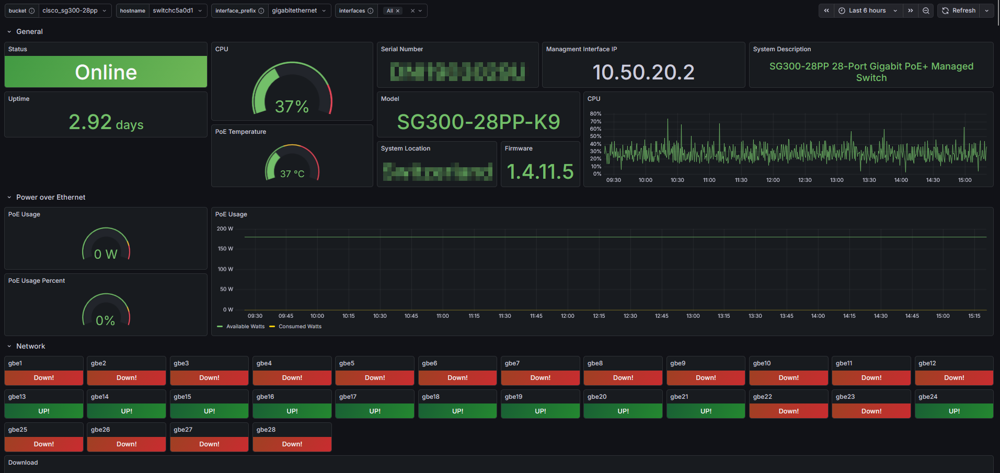
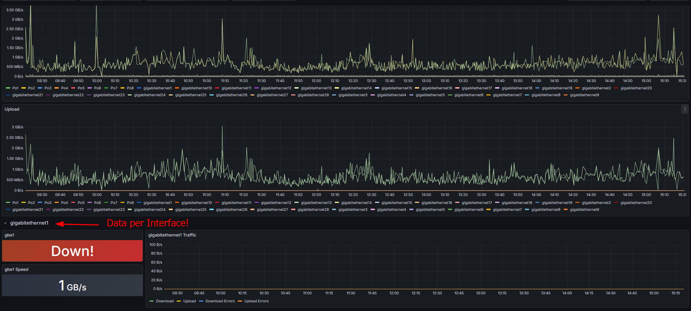

# Cisco SG300 Monitoring

A dashboard to display data from my Cisco SG300 Switch scraped via SNMP from Telegraf, stored in InfluxDB and visualized in Grafana.
[https://grafana.com/grafana/dashboards/24729-cisco-sg300-28pp/](https://grafana.com/grafana/dashboards/24729-cisco-sg300-28pp/)

### Info



### Updates

- **14.01.2026**
  - Initial Version

### Steps

```
1. Create a new InfluxDB Bucket

2. Create a new Telegraf Config in InfluxDB WebUI

3. Paste everything after the start comment from `telegraf.conf`, use the full config as reference when not using the InfluxDB WebUI to create the Telegraf config.

4. Make sure to change the IP addresses and Tags in the `telegraf.conf` configuration.

5. Import the Grafana Dashboard and select the Bucket defined in Telegraf.

5. Technically all Variables like interface names etc. should be fetched automatically from there on, though different configurations may introduce issue, so feel free to report them via Github Issues.

7. Enjoy
```

[How to: Add Prometheus Datasource to Grafana](https://grafana.com/docs/grafana/latest/datasources/prometheus/configure/)
